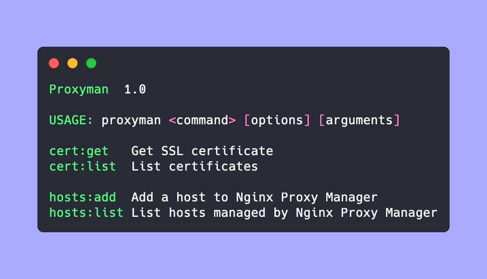

Proxyman is a simple cli tool for [nginx-proxy-manager](https://github.com/NginxProxyManager/nginx-proxy-manager)

I've written it for my own use cases, but feature requests and pull-requests are welcome.

# Dependencies
- PHP >= 8.0
- [mkcert](https://github.com/FiloSottile/mkcert) (for generating self-signed certificates)

# Installation
Download binary from latest release and place it in PATH

# Usage
## List proxy hosts
```bash
$ proxyman hosts:list
+--------------+----------------------+------+-----+---------+
| Domains      | Host                 | Port | SSL | Enabled |
+--------------+----------------------+------+-----+---------+
| mailhog.test | host.docker.internal | 8025 | ✓   | ✓       |
| proxy.test   | proxy                | 81   | ✓   | ✓       |
+--------------+----------------------+------+-----+---------+
```
## Add proxy host
```bash
$ proxyman hosts:add [options] <domains>
```
|  | Description |
|---|---|
| domains | Space separated list of domain names (incl. wildcards) |
| --host | Name of host or docker-compose service (default: host.docker.internal)|
| --port | Default: 80 |
| --https | Will create a self-signed certificate for the supplied domain names and force http requests to https |

## List self-signed certificates
```bash
$ proxyman certs:list
+------------------------+---------------------------------------------------+
| Name                   | Expires on                                        |
+------------------------+---------------------------------------------------+
| mailhog.test           | Saturday, May 25, 2024 6:26 PM (2 years from now) |
| proxy.test             | Saturday, May 25, 2024 6:25 PM (2 years from now) |
+------------------------+---------------------------------------------------+
```
## Get self-signed certificate
```bash
$ proxyman certs:get <name> [--write]
```
Writes the key and crt to stdout, or writes them to files in the current directory
